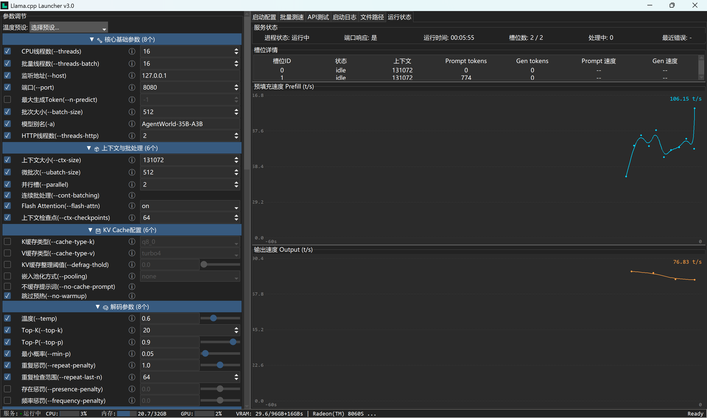
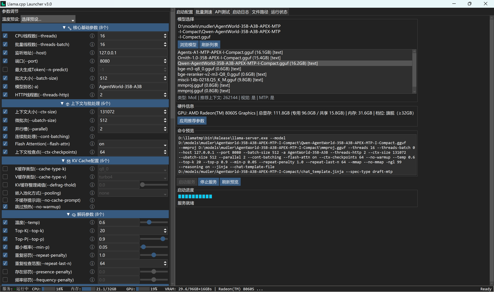

# LlamaCppLauncher

一个为 Windows 设计的 `llama-server.exe` 图形化启动器，支持模型库自动扫描、参数可视化调节、硬件/模型类型自动推荐、批量测速和实时运行状态监控。





## 主要特性

- **一键启停服务**：自动拉起 `llama-server.exe`，关闭窗口时强制清理残留进程。
- **模型库自动扫描**：支持多级目录，自动识别 `.gguf` 模型，并按文本/视觉/MTP 分类。
- **参数白话注释**：每个参数右侧都有 `ⓘ` 提示，解释含义、推荐值和常用取值，适合新手。
- **硬件与模型类型自动推荐**：根据 GPU 显存、内存和模型类型（稠密/MoE/MTP）自动推荐参数，对 AMD APU / Radeon 8060S 有专门优化。
- **上下文长度四档可调**：`ctx-size` 只保留 32k / 64k / 128k / 256k 四个档位，避免填错。
- **MTP 自动识别**：读取 GGUF 元数据，检测到内置 MTP 层时自动追加 `--spec-type draft-mtp --spec-draft-n-max 3`。
- **TurboQuant 分支参数**：为 `sunzx/llama-cpp-turboquant/tree/fix/turbo-kv-tensor-split` 单独提供 `-fit` / `-kvu` 等参数入口。
- **参数互斥/冲突锁定**：启用 `mirostat` 等参数时，与之冲突的采样参数会自动变灰并锁定。
- **系统提示词与温度预设**：内置 6 套中文角色提示词和 6 套 Kimi 采样配置（精确公文、标准平衡、创意写作、推理探索、长文本稳定、规划润色）。
- **自定义 Web UI**：支持通过 `--path` 指定自己的 `llama-server` 静态网页 UI 目录。
- **批量上下文测速**：在 32k/64k/128k/256k 等档位之间快速对比首 token 和生成速度。
- **实时运行状态可视化**：不依赖日志，直接显示运行时间、槽位、GPU/显存、Prefill/Output 速度，并用 Canvas 绘制双折线图。
- **能量格子启动进度条**：启动服务时显示简约的能量格动画，服务就绪后全部点亮。
- **全局异常记录**：未捕获的 UI 异常会写入 `logs/errors.log`，方便排查启动问题。

## 系统要求

- Windows 10 / 11
- Python 3.10+（源码运行）
- 已编译好的 `llama-server.exe`（支持原版 llama.cpp 或 llama-cpp-turboquant 分支）
- 推荐 AMD Radeon / Ryzen AI Max 系列 APU（对共享大内存平台做了 `-kvu`、`-flash-attn` 等优化）

## 快速开始

### 源码运行

```bash
cd D:\llama-launcher
run-directly.bat
```

`run-directly.bat` 会自动检查并安装依赖（`ttkbootstrap`、`psutil`、`pywin32`、`wmi`）。

### 使用步骤

1. 在右侧“启动配置”里选择模型库目录，程序会自动扫描模型。
2. 选中一个模型，程序会自动读取 GGUF 元数据并推荐上下文和硬件参数。
3. 在左侧调节参数（或使用顶部“硬件推荐”一键应用）。
4. 点击“启动服务”，等待能量格子满格和 `/health` 就绪。
5. 切换到“运行状态”Tab 查看实时速度和槽位。

## 项目结构

```
D:\llama-launcher
├── core/               # 配置、服务器管理、硬件监控、状态监控、UI 执行器
├── ui/                 # 主窗口、左侧面板、右侧面板、状态 Tab
├── utils/              # 模型扫描、GGUF 元数据、性能预设、辅助函数
├── llama-params.json   # 所有可调参数定义（含注释、冲突、默认值）
├── config.json         # 系统提示词、温度预设、UI 配置
├── run-directly.bat    # 直接运行
├── LICENSE             # Apache-2.0
└── README.md           # 本文件
```

## 参数说明

所有参数都集中在 `llama-params.json` 中，左侧面板会根据该文件动态渲染。关键参数包括：

| 参数 | 说明 |
|------|------|
| `--ctx-size` | 上下文长度，只保留 32k/64k/128k/256k 四档 |
| `--threads` | CPU 线程数，建议偶数 |
| `--threads-batch` | 批量处理线程数，0 表示跟随 `--threads` |
| `--ngl` | 模型层数 offload 到 GPU |
| `--kv-unified` | AMD APU 共享大内存场景下开启统一 KV（与 `-fit` 互斥） |
| `--flash-attn` | 枚举值 `on/off/auto`，AMD APU 推荐 `on` |
| `--spec-type` | MTP 投机采样类型，如 `draft-mtp` |

## 鸣谢与许可

- 底层推理由 [llama.cpp](https://github.com/ggml-org/llama.cpp) 及其衍生分支提供。
- 界面使用 [ttkbootstrap](https://github.com/israel-dryer/ttkbootstrap)。
- 本项目采用 [Apache-2.0](LICENSE) 许可证，允许商用并附带专利授权声明。

## 常见问题

**Q: 启动时命令提示符里出现 `tkinter.TclError: expected floating-point number but got ""`？**  
A: 已修复。原因是数值控件的 `trace_add` 回调在变量过渡态（空字符串）下调用 `get()` 抛错。现在已对所有 `IntVar/DoubleVar` 回调加了 `TclError` 兜底。

**Q: 关闭窗口后 `llama-server.exe` 还在运行？**  
A: 已修复。窗口关闭时会调用 `taskkill /F /T /PID` 强制终止服务进程，并清理状态监控线程。

**Q: 非视觉模型为什么会加载上一个模型的 `mmproj`？**  
A: 已修复。现在只在当前模型同目录下找到 `mmproj*.gguf` 时才会追加 `--mmproj`。

**Q: 批量测速没有数据？**  
A: 已改为真实 `/v1/chat/completions` 请求 + 日志解析，兼容 `tokens per second`、`tokens/s`、`t/s` 等多种速度格式。
